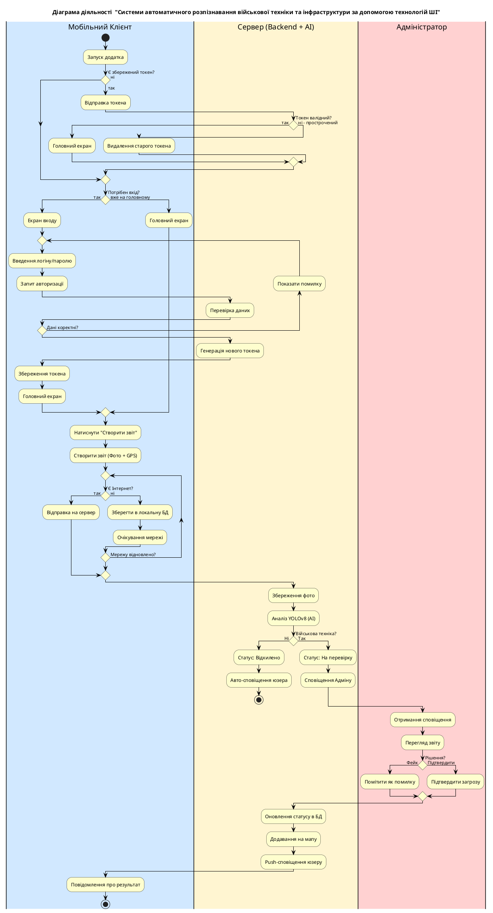
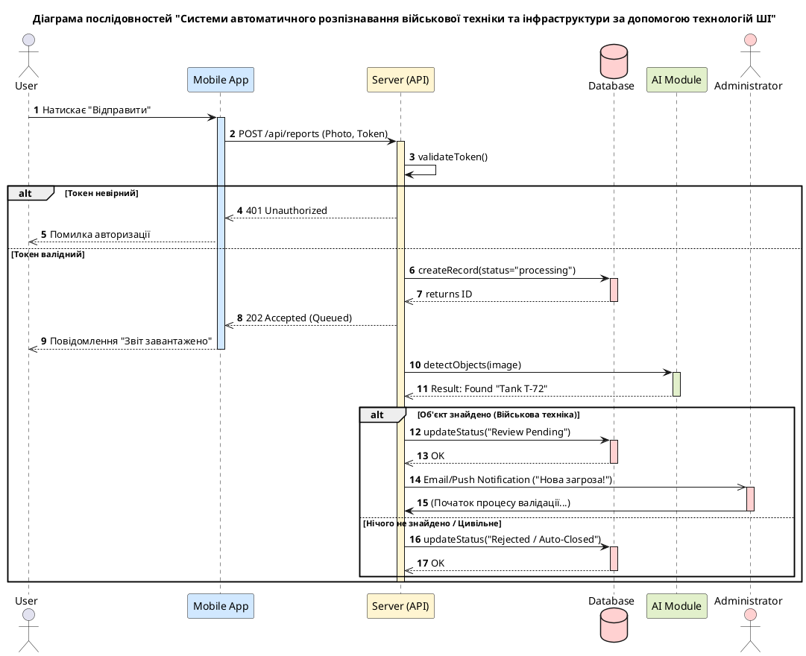

# Practical lesson pz-UML Mazur
## Побудова повердінкових UML-діаграм для проєктування інформаційної Системи автоматичного розпізнавання військової техніки та інфраструктури за допомогою технологій ШІ 

## Концепція

Мобільний застосунок подвійного використання з метою OSINT збору інформації, що надає певний користувацький функціонал (соціальна мережа/карта-довідник/ґейміфікація тощо) пов'язаний з передачею фото (потенційно аудіо, коротких відео) матеріалів та їх метаданих, з метою скритої обробки штучним інтелектом, засобами машинного зору, на предмет військової техніки та інфраструктури, зафіксованої на фото через недбалість посадових осіб або окремих громадян країни-агресора з подальшою верифікацією адміністраторами застосунку і внесенням інформації до бази данних.

## Виконана робота:

- Побудовано три UML-діаграми:
    - Use Case Diagram
    - Activity Diagram
    - Sequence Diagram

- Діаграми логічно пов’язані між собою та відповідають обраній предметній області
- Коректно використані основні UML-нотації та позначення
- Усі діаграми збережені у вигляді зображень (.png) та файлів (.pdf), наданий доступ до проєктів у [draw.io](https://www.drawio.com/)
- Опис роботи та діаграми оформлені в markdown

## Посилання на Діаграми
### Google Drive:
*Доступ наданий за електронною поштою:*

  
Показати e-mail

  andrii.zadvornyi@viti.edu.ua

---

*Use-Case Diagram: https://drive.google.com/file/d/1Iuss0OdwztUC3nQ9kwaP2JSrxk0oJOzQ/view?usp=sharing*

*Activity Diagram: https://drive.google.com/file/d/1U3urWJJU7TTCPfU_OyrhfnYhom2vF4Y2/view?usp=sharing*

*Sequence Diagram: https://drive.google.com/file/d/11n39m48Y76xvzQpHvDclq8TOmGOHhXTq/view?usp=sharing*

## Опис діаграм
### Use-Case Diagram:

- Актори: 
    - Користувач, що має основні випадки використання.
    - Адміністратор, що **екстендить** Користувача
- Use-cases:
    - Перегляд карти (Або інший власне користувацький функціонал, що існує для маскування основного функціоналу і "витягування" даних розвідки)
    - Завантаження звіту, що включає в себе (зв'язок **include**) Розпізнавання ШІ
    - Розпізнавання ШІ, що неаявно виконується на сервері при завантажені кожного звіту
    - Вхід в систему, *bad practice* для такого типу діаграм, так як повинно бути передумовою використання системи, але включений на діаграму щоб підкреслити важливість ведення і наявності особистого акаунту користувача, як важливий елемент функціоналу соціальної мережі або при додавані елементів ґейміфікації (ведення профілю, прогрес, досягнення тощо)
    - Валідація звітів, use-case адміністратора, що валідує, тобто підтверджує точність перевірки ШІ.
 
---

### Activity Diagram:

PlantUML кодом:

- Складові процесу (поділені на Swimlanes):
    - Мобільний Клієнт: фронтенд-частина, з якою взаємодіє користувач (створення звітів, авторизація, робота з локальною БД).

    - Сервер (Backend + AI): центральний вузол, де відбувається основна бізнес-логіка, генерація токенів та аналіз зображень нейромережею.

    - Адміністратор: людина-оператор, яка виступає фінальним фільтром для підтвердження результатів розпізнавання.

- Ключові етапи процесу:

    - Гнучка авторизація: реалізована логіка перевірки наявного токена. Якщо токен валідний — користувач одразу потрапляє на головний екран, якщо ні — проходить цикл введення логіна/пароля.

    - Офлайн-режим (Local Storage): важливий елемент системи для роботи в умовах нестійкого з'єднання. При відсутності інтернету звіт зберігається в локальну БД (SQLite) і чекає на відновлення мережі для відправки.

    - Інтелектуальний аналіз (YOLOv8): автоматизований етап обробки фото на сервері. Якщо ШІ не ідентифікує військову техніку, система автоматично відхиляє звіт без залучення адміністратора, при цьому користувацьких функціонал виконується.

    - Двоетапна верифікація: звіти, що пройшли фільтр ШІ, потрапляють на розгляд адміністратору. Це мінімізує кількість помилок (false positive) та гарантує достовірність, важливу для військового використання.
    - Замикання циклу (Feedback loop): після рішення адміністратора сервер оновлює базу розвідувальних даних, додає об'єкт на адміністраторську версію карти. При цьому для користувача додаток працює звичайним чином.

---

### Sequence Diagram:

PlantUML кодом:

- Учасники взаємодії (Lifelines):

    - Користувач та Мобільний додаток: ініціатори процесу, що взаємодіють через API-запити.

    - Сервер (API): центральний контролер, який координує роботу бази даних та модуля ШІ.

    - База даних: забезпечує збереження звітів та їх станів (false-звіти, які відображаються для користувача та positive-звіти, які відображаються як користувачам так і особливо відмічаються на адміністраторській карті)

    - AI Module: виконує безпосередню обробку зображення для пошуку об'єктів.

    - Адміністратор: здійснює остаточну верифікацію.

- Ключові етапи та логіка:

    - Валідація безпеки (alt-блок): перед початком будь-якої обробки сервер перевіряє токен доступу. У разі невірного токена повертається помилка 401 Unauthorized, що миттєво перериває ланцюжок.

    - Асинхронна обробка: додаток отримує відповідь 202 Accepted (Queued) одразу після створення запису в БД. Це дозволяє користувачу не чекати і "не відчувати" роботу ШІ, покращуючи UX (User Experience).

    - Робота модуля ШІ: сервер викликає умовну функцію e. g. detectObjects, яка повертає конкретний результат аналізу.

    - Гілкування бізнес-логіки (alt-блок):

        - Cценарій «Об'єкт знайдено»: статус звіту оновлюється на очікування перевірки, а адміністратор отримує push-повідомлення про нову загрозу.

        - Сценарій «Цивільний об'єкт/Нічого не знайдено»: система автоматично закриває звіт зі статусом «Rejected», зменшуючи навантаження на адміністратора.

